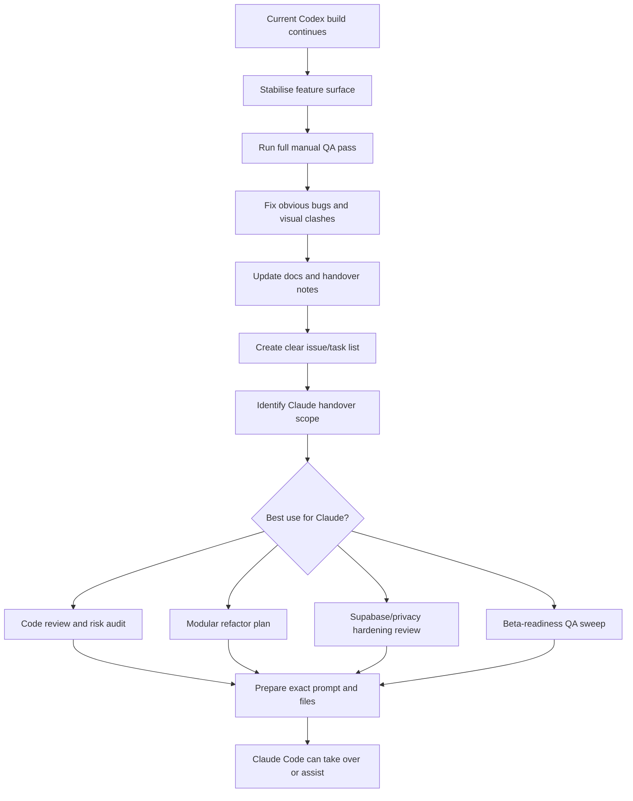

# Claude Transition Plan

Target handover date: 2026-07-07

Purpose: prepare Corso so a second coding agent, such as Claude Code, can review, refactor, harden, or continue the build without losing context or burning time rediscovering decisions.

## Transition Flow



## Target Outcome By 7 July

By 2026-07-07, Corso should be in a clean enough state that Claude Code can be given a specific, bounded job without needing the whole product re-explained.

The ideal handover package should include:

- A current handover summary.
- A current roadmap.
- A standalone first-review brief.
- A known issues list.
- A QA checklist with pass/fail notes.
- A clear decision on what Claude should do first.
- Passing smoke tests.
- A stable demo URL or local run command.
- No mystery around privacy, student data, or school-scoped access expectations.

## Checklist

### 1. Stabilise The Current Feature Surface

- [x] Stop adding brand-new major features unless they unblock beta readiness.
- [x] Confirm the current tabs load without JavaScript errors:
  - [x] Scanner
  - [x] Students
  - [x] Sports
  - [x] Training
  - [x] Leaderboard
  - [x] Activity
  - [x] Events
  - [x] Awards
  - [x] Programming
  - [x] Reports
  - [x] School Settings
  - [x] Coach Tools
  - [x] Import
  - [x] Help
- [x] Confirm dark mode and light mode remain readable on all major pages.
- [x] Confirm hover states only make sense on actual buttons/links.
- [x] Confirm no major clipping on laptop, iPad and phone widths.

Stage 1 progress on 2026-06-17:

- [x] Ran core smoke checks: portal smoke, goals baseline, backend live-style, scanning live-mode, Supabase staging, and `node --check admin-dashboard.js`.
- [x] Confirmed main desktop routes load without console errors across home, admin login, admin dashboard tabs, student profile, parent portal, kiosk, and leaderboard.
- [x] Confirmed phone-width checks for Student Profile admin view, Leaderboard, Programming, and Sports have no horizontal overflow after fixes.
- [x] Converted public leaderboard tables into stacked mobile cards below 480px to prevent phone clipping.
- [x] Fixed Student Profile admin action buttons so they wrap cleanly on phones.
- [x] Normalised HTML pages to `styles.css?v=108` and bumped the service worker cache to `gwynne-park-run-club-v147`.
- [x] Fixed Mini Coach floating button dark-mode override so it stays readable after later widget CSS rules.
- [x] Clicked through every Admin tab from the actual tab buttons and confirmed the correct panel opened with no console errors or horizontal overflow.
- [x] Verified desktop modal open/close and centred placement for Sports consent, Sports event teams, and Coach Tools.
- [x] Verified phone-width modal open/close and viewport fit for Student Edit, Sports consent, Sports event teams, and Coach Tools.
- [x] Verified Mini Coach opens, closes, stays in viewport, and answers a typed question through the visible Ask button.
- [x] Verified School Settings quick apply buttons show success feedback.
- [x] Verified Training select-all toggles all visible student checkboxes.
- [x] Verified deeper form submission QA for Add Student, Student Edit modal, coach goal assignment, training assignment save, calendar event creation, custom award creation, challenge creation, scanner start/scan/duplicate/finish, and student training completion.
- [x] Fixed Add Student so it no longer auto-opens the barcode print window; it now creates the student and leaves printing as a deliberate Barcode action.
- [x] Source-verified guarded/print-style actions that cannot be safely auto-clicked in browser automation: roster delete, refresh progress confirm, undo scan confirm, barcode print, award/certificate print, import template download.

### 2. Manual QA Pass

- [x] Admin login works.
- [x] Student login works.
- [x] Parent portal opens and remains read-only.
- [x] Kiosk is admin-only.
- [x] Kiosk exit returns home.
- [x] Scanner can start/finish a session.
- [x] Scanner can log a student lap.
- [x] Duplicate scan protection still works.
- [x] Undo/review last scan still works.
- [x] Student add/edit/delete still works.
- [x] Student barcode generation still works.
- [x] Student profile links from Admin keep admin view.
- [x] Student timeline only shows run club attendance/laps.
- [x] Student training checklist can be ticked.
- [x] Parent certificates print cleanly.
- [x] Awards tab is readable in dark/light mode.
- [x] Events calendar still opens and shows expected items.
- [x] Programming catalogue loads all 21 lesson/session plans.
- [x] Programming activities expand with how/cues/safety/progression links.
- [x] Mini Coach opens upward and stays visible.
- [x] Mini Coach quick chips work.
- [x] Mini Coach can generate a draft program from a goal.
- [x] Mini Coach generated program can apply the first session.

### To Be Completed By Jeremy At The Very End

These browser-native actions, school approvals, and final human decisions should be completed by Jeremy in Firefox/Chrome and through school/admin channels at the very end. The app can be source-verified, but these items require real browser dialogs, real accounts, or human sign-off.

Browser-native checks:

- [ ] Barcode print window.
- [ ] Parent award certificate print.
- [ ] Admin certificate/award print paths.
- [ ] Delete confirmation.
- [ ] Undo scan confirmation.
- [ ] Refresh progress confirmation.
- [ ] Import/template download.
- [ ] Sports team list print window.
- [ ] Sports team list CSV export/download.

School and privacy sign-off:

- [ ] Confirm school leadership approval before any real student data is entered.
- [ ] Confirm parent/guardian communication wording is approved by the school.
- [ ] Confirm the privacy policy is acceptable for the school context.
- [ ] Confirm the medical notes wording matches school health-care-plan expectations.
- [ ] Confirm demo data has been exported or cleared before real roster import.
- [ ] Confirm universal `DEMO` access is disabled before launch with real students.

Production setup decisions:

- [ ] Choose the live hosting destination and domain/subdomain.
- [ ] Add real Supabase project URL, anon key, school ID, and live config only after RLS/auth review.
- [ ] Start Docker Desktop / Linux engine before local Supabase commands.
- [ ] Set `SUPABASE_URL`, `SUPABASE_ANON_KEY`, and `RUN_CLUB_SCHOOL_ID` for staging checks.
- [ ] Confirm staff/coach invite list and role levels.
- [ ] Confirm parent/guardian access-code process.
- [ ] Confirm scanner devices, phone/iPad camera scanning, and kiosk workflow on real hardware.
- [ ] Confirm backup/export routine for school records.

Final content and brand decisions:

- [ ] Confirm final school-facing app name and logo for the live school.
- [ ] Confirm support widget wording and whether it stays visible for school use.
- [ ] Confirm any public-facing screenshots or demo links contain no student-identifying data.
- [ ] Confirm whether Compass integration remains a future item or is removed from the launch scope.

Stage 2 progress on 2026-06-18:

- [x] Demo admin login opens the admin dashboard.
- [x] Clean student login with `STUDENT1` opens James Smith's profile.
- [x] Parent portal with `STUDENT1` opens a read-only child view with no editable controls in the result area.
- [x] Kiosk loads for an admin session and Exit kiosk returns to the home dashboard.
- [x] Student training checklist can be ticked and changes to Completed.
- [x] Student timeline stays limited to run club attendance/lap messaging, not training/task history.
- [x] Programming catalogue reports 21 sessions.
- [x] Mini Coach Build program chip generates a program and Apply first session changes the active programming session.
- [x] Certificate/print workflows are source-verified and buttons are present; final print-window visual QA remains a human browser check because print opens external browser windows.

### 3. Sports / Interschool QA

- [x] Sports tab layout feels like one command centre.
- [x] Interschool Athletics Mode toggle works.
- [x] Cross Country visibility toggle works.
- [x] Consent checklist opens as a centred popup.
- [x] Consent checklist rows stay compact for large rosters.
- [x] Consent statuses work:
  - [x] blank
  - [x] pending
  - [x] approved
  - [x] declined
- [x] Team list summary shows:
  - [x] student
  - [x] division
  - [x] year
  - [x] class
  - [x] events
  - [x] PBs if available
  - [x] consent status
- [x] Junior events only show Year 1-2 students.
- [x] Intermediate events only show Year 3-4 students.
- [x] Senior events only show Year 5-6 students.
- [x] Junior 50m does not show senior students.
- [x] Intermediate 75m does not show junior/senior students.
- [x] Senior 100m does not show junior/intermediate students.
- [x] Interschool training/attendance does not add Run Club laps.
- [x] Ball games are separated clearly by division/year where needed.
- [x] Vortex Throw, Long Jump and Baton Relay event flows are usable.

Stage 3 progress on 2026-06-18:

- [x] Browser-verified Sports tab opens directly as a command centre with Interschool Athletics Mode active and event chips visible.
- [x] Browser-verified event popups stay in viewport on iPad width and phone width.
- [x] Browser-verified Junior 50m shows no senior students, Intermediate 75m shows Year 3-4 only, and Senior 100m shows Year 5-6 only.
- [x] Browser-verified result-entry dropdowns use the same division eligibility rules as event team popups.
- [x] Browser-verified Ball Games use an in-popup division dropdown.
- [x] Browser-verified consent checklist is compact, centred, saveable, and exposes blank, pending, approved, and declined statuses.
- [x] Browser-verified Cross Country show/hide toggle updates the visible panel and command summary.
- [x] Browser-verified saving a Senior 100m team updates the Team List Summary table with student, year, class, division, events, PBs, and consent.
- [x] Source-verified athletics results write to the athletics result store and do not mutate Run Club lap totals.

### 4. Privacy And Data Readiness

- [x] Confirm demo mode is still clearly demo/local.
- [x] Confirm no private keys are in browser files.
- [x] Confirm no real student data has been committed.
- [x] Confirm privacy policy still matches the intended access model.
- [x] Confirm students cannot self-report activity.
- [x] Confirm students cannot access kiosk/admin sections.
- [x] Confirm parent access is read-only.
- [x] Confirm medical notes are not public.
- [x] Confirm live backend readiness gate still blocks unsafe live/local writes.
- [x] Confirm `docs/access-model-decision.md` still matches the product.
- [x] Confirm `docs/backend-stack-decision.md` still matches the product.

Stage 4 progress on 2026-06-18:

- [x] Patched `privacy-policy.html` so student access is described as school-issued barcode, QR code, or backend-generated non-guessable access code, not old name-based codes.
- [x] Source-verified `config.js` is demo/local by default: demo mode on, sync off, live data mode off, empty school ID, Supabase URL, and anon key.
- [x] Source-verified browser-delivered backend config is public-only and contains no service-role/private credential values.
- [x] Source-verified no CSV/roster/private data files are present in the repo file list.
- [x] Source-verified admin dashboard and kiosk both require `runClubAdminSession` before running.
- [x] Browser-verified parent portal opens a read-only demo profile with no form fields in the child result area; certificate print remains in Jeremy's final manual-click list.
- [x] Source-verified medical notes appear only in admin, student profile, parent profile, and backend medical-note paths, not public leaderboard or kiosk.
- [x] Source-verified student-facing profile allows non-scoring reflections only and does not provide a lap/activity self-report form.
- [x] Source-verified backend readiness/live roster guard blocks roster, scan/session, medical, guardian, training, sports, activity-credit, coach-note, notification, Compass import, and CSV import writes when live mode is enabled before backend readiness.

### 5. Automated Checks

Run before handover:

```powershell
node tests/portal-smoke.test.js
node tests/goals-baseline.test.js
node --check admin-dashboard.js
git diff --check -- admin-dashboard.html admin-dashboard.js styles.css tests/portal-smoke.test.js service-worker.js docs/handover-summary.md
```

Optional backend/staging checks:

```powershell
node tests/backend-live-style.test.js
node tests/scanning-live-mode.test.js
node tests/supabase-staging.test.js
node scripts/staging-readiness-check.js
```

Record results here:

- [x] Portal smoke checks passed.
- [x] Goal baseline checks passed.
- [x] Admin dashboard syntax passed.
- [x] Diff whitespace check passed.
- [x] Backend/live-style checks reviewed or intentionally deferred.

Stage 5 progress on 2026-06-18:

- [x] `node tests/portal-smoke.test.js` passed.
- [x] `node tests/goals-baseline.test.js` passed.
- [x] `node --check admin-dashboard.js` passed.
- [x] `node tests/backend-live-style.test.js` passed.
- [x] `node tests/scanning-live-mode.test.js` passed.
- [x] `node tests/supabase-staging.test.js` passed.
- [x] `git diff --check` passed for dashboard, styling, tests, docs, service worker, and privacy policy files. Only expected LF/CRLF warnings appeared.

### 6. Documentation Pack

- [x] Update `docs/handover-summary.md`.
- [x] Update `FEATURES.md` if priorities changed.
- [x] Update `docs/roadmap-progress.md` if status changed.
- [x] Add current known bugs under a dated heading.
- [x] Add current local URL and run command.
- [x] Add latest asset versions:
  - [x] `styles.css?v=...`
  - [x] `admin-dashboard.js?v=...`
  - [x] `service-worker.js` cache version
- [x] Add latest Mini Coach capabilities.
- [x] Add latest Sports/Interschool notes.

Stage 6 progress on 2026-06-18:

- [x] `docs/handover-summary.md` now reflects completed Stage 3 Sports QA, Stage 4 privacy/data readiness, and Stage 5 automated checks.
- [x] `FEATURES.md` already showed all core priority lanes complete and Priority 9 skeletons bookmarked; no feature-priority status change was required.
- [x] `docs/roadmap-progress.md` already showed the same completed priority status; no status change was required.
- [x] Known caveats are documented in the handover under known risks, known areas to keep reviewing, and Jeremy's final sign-off list.
- [x] Current local URL and run command remain documented in `docs/handover-summary.md`.
- [x] Current asset versions remain documented: `styles.css?v=108`, `admin-dashboard.js?v=72`, and `gwynne-park-run-club-v147`.
- [x] Mini Coach capabilities remain documented in `docs/handover-summary.md`.
- [x] Sports/Interschool notes now include the latest Stage 3 QA completion.

### 7. Decide Claude's First Job

Choose one primary handover job. Do not give Claude everything at once.

- [x] Option A: Code review and bug/risk audit.
- [ ] Option B: Refactor `admin-dashboard.js` into modules.
- [ ] Option C: Supabase/auth/RLS/privacy hardening review.
- [ ] Option D: Full beta QA pass and issue list.
- [ ] Option E: PWA/app-store packaging research.

Selected first job:

- [x] Claude's first task is **Option A: Code review and bug/risk audit**.
- [x] Claude should produce findings first, with file/line references where possible.
- [x] Claude should not perform a large rewrite in the first pass.
- [x] Claude should turn the review into a proposed modularisation plan for `admin-dashboard.js`.
- [x] Claude should treat privacy, student data boundaries, Sports/Interschool flows, Programming/Mini Coach, dark/light contrast, and backend readiness gates as high-priority review areas.
- [x] Option B should come second only after the review findings are discussed.

Recommended first Claude job:

```text
Review the Corso codebase for maintainability, privacy risks, frontend bugs, and refactor opportunities. Do not rewrite large files yet. Produce a prioritised issue list with file references and a proposed modularisation plan for admin-dashboard.js.
```

Stage 7 progress on 2026-06-18:

- [x] Selected Option A as the first Claude/second-agent job.
- [x] Confirmed the handover should start with review/audit before refactor.
- [x] Confirmed the first review should prioritise maintainability, privacy boundaries, frontend bugs, and refactor opportunities.
- [x] Confirmed `admin-dashboard.js` modularisation is a plan output, not an immediate rewrite.

### 8. Prepare Claude Prompt

- [x] Include product summary.
- [x] Include privacy rules.
- [x] Include local run command.
- [x] Include test commands.
- [x] Include handover summary path.
- [x] Include roadmap path.
- [x] Include standalone first-review brief path.
- [x] Include exact first task.
- [x] Tell Claude not to enter, invent, or expose real student data.
- [x] Tell Claude not to make destructive git changes.
- [x] Tell Claude to preserve current UX unless specifically improving a bug.

Draft prompt:

```text
You are taking over work on Corso, a privacy-first school run club and athletics platform for school staff, students, and parents. The product tracks run club laps, awards, training assignments, parent/student visibility, interschool athletics, cross country, programming resources, and admin reporting.

Start by reading:

- docs/handover-summary.md
- docs/claude-transition-plan.md
- docs/claude-first-review-brief.md
- docs/education-compliance-readiness.md
- FEATURES.md
- docs/roadmap-progress.md
- docs/access-model-decision.md
- docs/backend-stack-decision.md
- README.md
- admin-dashboard.html
- admin-dashboard.js
- styles.css
- config.js
- backend.js

Privacy rules:

- Do not enter, invent, expose, or commit real student data.
- Do not remove privacy gates.
- Do not weaken school-scoped access assumptions.
- Students must only see their own information.
- Parents must only see their own linked child/children.
- Kiosk and admin sections must remain staff/admin gated.
- Medical notes must not appear in public leaderboard or kiosk views.
- Keep demo/local mode until school approval, live auth, RLS, and backend readiness are confirmed.

Development rules:

- Do not make destructive git changes.
- Do not run `git reset --hard` or revert unrelated user work.
- Preserve the current UX unless fixing a specific bug or accessibility/contrast issue.
- Findings should come before summaries.
- Avoid large rewrites until the review is discussed.

First task:

Review the Corso codebase for maintainability, frontend bugs, privacy risks, and refactor opportunities. Prioritise findings with file references and severity. Pay special attention to:

- `admin-dashboard.js` size and module boundaries
- Sports/Interschool Athletics flows
- Programming/Mini Coach
- dark/light mode contrast
- backend readiness gates
- parent/student/kiosk access boundaries
- medical note visibility
- mobile/iPad layout risk

Deliverables:

1. Prioritised bug/risk list with file references.
2. Proposed modularisation plan for `admin-dashboard.js`.
3. Suggested first small refactor or bugfix after the review.
4. Any tests or manual QA paths that should be added.

Local run command: python -m http.server 8080
Local URL: http://127.0.0.1:8080
Core checks:

- node tests/portal-smoke.test.js
- node tests/goals-baseline.test.js
- node tests/backend-live-style.test.js
- node tests/scanning-live-mode.test.js
- node tests/supabase-staging.test.js
- node --check admin-dashboard.js
- git diff --check
```

Stage 8 progress on 2026-06-18:

- [x] Completed a full Claude/second-agent prompt with product summary, privacy rules, file paths, run command, test commands, exact first task, and development boundaries.
- [x] Added explicit instructions not to enter/invent real student data, not to make destructive git changes, and not to rewrite large files before review discussion.
- [x] Added expected deliverables for findings, modularisation plan, first small next step, and test/QA suggestions.

Stage 8 update on 2026-06-22:

- [x] Added `docs/claude-first-review-brief.md` as a clean standalone handoff brief.
- [x] Included the latest Compliance workspace, school admin signup sheet, evidence pack, parent notice, breach log, and live-readiness context in the handoff scope.

## Beta QA / Known Issues List

Known code issues at this checkpoint:

- No confirmed blocking code bugs are currently recorded after Stages 1-8.
- `admin-dashboard.js` is very large and should be reviewed before the next major feature build.
- Priority 9 smart-coach/celebration tools are skeletons only; do not treat them as production AI or automated coaching advice yet.
- Real Supabase/live deployment is not configured in local browser config; keep demo mode until the real school backend is reviewed.
- Optional staging readiness currently needs Jeremy/setup action: Docker Desktop Linux engine running plus `SUPABASE_URL`, `SUPABASE_ANON_KEY`, and `RUN_CLUB_SCHOOL_ID` environment values.

Deep audit pass on 2026-06-18:

- [x] JavaScript syntax checked across all non-`node_modules` JS files.
- [x] Full npm test suite passed.
- [x] `npm run build` passed and regenerated root deploy files from `src/`.
- [x] Deployable HTML/service-worker local references and duplicate IDs checked.
- [x] Obvious TODO/FIXME/debugger/eval/secret-pattern scan checked.
- [x] Browser route checks found no console errors, missing images, or horizontal overflow on the sampled public/admin/kiosk routes.
- [x] Confirmed admin dashboard `?tab=sports` deep link activates the Sports panel.
- [x] Fixed build-source drift in `src/backend/backend.js` so live-ready Sports/Coach Tools methods survive `npm run build`.
- [x] Fixed build-source drift in `src/scanning/scanning.js` so interschool, athletics, Cross Country, training, and carnival scans are attendance-only and do not change Run Club lap totals.
- [x] Confirmed Sports consent and event-team modals are centred and viewport-safe on desktop and phone widths.
- [x] Confirmed Senior 100m event filtering shows Year 5/6 students only in the modal.
- [x] Removed untracked temporary `.tmp-*.png` QA screenshots.

Beta QA paths to run before sharing broadly:

- [ ] Laptop: admin login, all admin tabs, add/edit student, assign training, Sports team selection, reports.
- [ ] iPad: scanner/kiosk flow, camera scanning permission, Sports modal sizing, student profile.
- [ ] Phone: home navigation, student login/profile, parent portal, leaderboard, print/download alternatives.
- [ ] Scanner hardware: Bluetooth/HID scan, duplicate protection, undo scan, finish session.
- [ ] Parent flow: guardian-code access, read-only checks, award certificate print.
- [ ] Student flow: own profile only, barcode display, training checklist, no self-report lap/activity path.
- [ ] Privacy flow: no real student data in demo links/screenshots, no medical notes in public/kiosk views.
- [ ] Backend/live flow: only after staging env is configured, run readiness check and live-style tests again.

## Suggested Timeline

### 17-21 June

- [x] Finish current Mini Coach/Programming polish.
- [x] Complete a full Admin tab click-through.
- [x] Log obvious bugs.

### 22-26 June

- [x] Fix Sports/Interschool Athletics issues.
- [x] Confirm mobile/iPad layout.
- [x] Confirm kiosk/scanner flows.

### 27 June-1 July

- [x] Update privacy/backend docs.
- [x] Run automated checks.
- [x] Freeze major feature additions unless critical.

### 2-5 July

- [x] Final handover summary update.
- [x] Prepare Claude prompt.
- [x] Decide Claude's first job.
- [ ] Optional: push/commit clean checkpoint.

### 6-7 July

- [ ] Final smoke test.
- [ ] Final manual test of critical paths.
- [ ] Hand over to Claude Code or second reviewer.

## Done Means

This transition plan is ready when:

- The platform can be explained from docs without reading the whole chat.
- The latest handover summary is accurate.
- Core checks pass.
- Known issues are listed instead of hidden.
- Claude has one clear first task.
- Real student data/privacy constraints are explicit.
